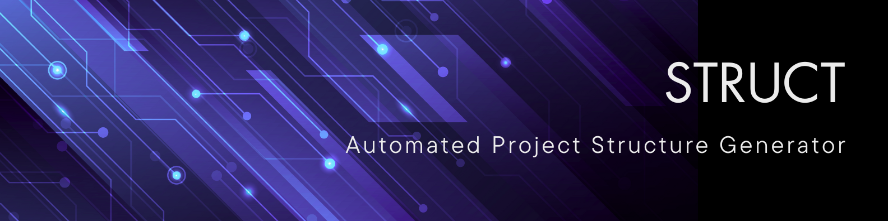

# 🚀 STRUCT: Automated Project Structure Generator

[](https://github.com/httpdss/struct/blob/master/README.md) [](https://github.com/httpdss/struct/blob/master/README.es.md)



STRUCT automates the creation of project structures from YAML templates. It is aimed at developers and DevOps engineers who want reproducible scaffolding with minimal effort. A Spanish translation is available in [README.es.md](README.es.md).

## Features

- Define project layouts using YAML
- Template variables with optional interactive prompts
- Custom file permissions
- Remote file inclusion (HTTP/GitHub/S3/GCS)
- Multiple strategies for existing files
- Dry-run mode and configuration validation
- Verbose logging

## Quick Start

Install using pip:

```sh
pip install git+https://github.com/httpdss/struct.git
```

Or run the Docker image:

```sh
docker run \
  -v $(pwd):/workdir \
  -u $(id -u):$(id -g) \
  ghcr.io/httpdss/struct:main generate \
  /workdir/example/structure.yaml \
  /workdir/example_output
```

## Documentation

Complete documentation is available in the [docs](docs) directory:

- [Installation](docs/installation.md)
- [Usage](docs/usage.md)
- [YAML configuration reference](docs/configuration.md)
- [YAML schema](docs/yaml_schema.md)
- [GitHub trigger script](docs/github_trigger_script.md)
- [Development](docs/development.md)
- [Command-line completion](docs/completion.md)
- [Hooks](docs/hooks.md)
- [Articles](docs/articles.md)
- [Available structures](docs/structures.md)

## License

This project is licensed under the MIT License. See the [LICENSE](LICENSE) file for details.

## Funding

If you find this project helpful, please consider supporting it through donations: [patreon/structproject](https://patreon.com/structproject)

## Contributing

Contributions are welcome! Please open an issue or submit a pull request.

## Acknowledgments

Special thanks to all the contributors who helped make this project possible.

## Known Issues

- [ ] TBD
