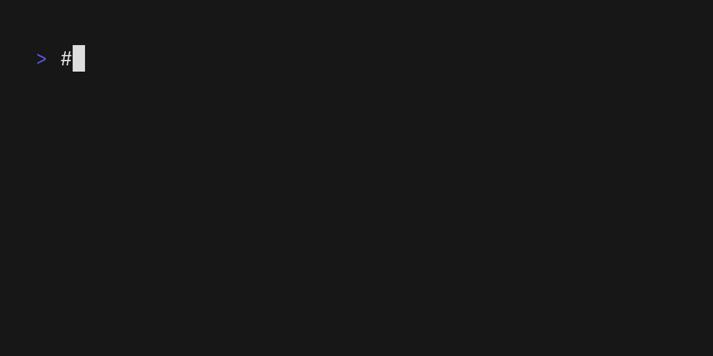

# Basic Usage

Run the script with the following command using one of the following subcommands:

- `generate`: Generate the project structure based on the YAML configuration.
- `generate-schema`: Generate JSON schema for available structure templates.
- `validate`: Validate the YAML configuration file.
- `info`: Display information about the script and its dependencies.
- `list`: List the available structs

For more information, run the script with the `-h` or `--help` option (this is also available for each subcommand):



```sh
struct -h
```

## Generate Command

### Simple Example

```sh
struct generate terraform-module ./my-terraform-module
```

### Complete Example

```sh
struct generate \
  --log=DEBUG \
  --dry-run \
  --backup=/path/to/backup \
  --file-strategy=rename \
  --log-file=/path/to/logfile.log \
  terraform-module \
  ./my-terraform-module
```

### Command Options

- `--log`: Set logging level (DEBUG, INFO, WARNING, ERROR)
- `--dry-run`: Preview actions without making changes
- `--backup`: Specify backup directory for existing files
- `--file-strategy`: Choose how to handle existing files (overwrite, skip, append, rename, backup)
- `--log-file`: Write logs to specified file
- `--mappings-file`: Provide external mappings file

## Generate Schema Command

The `generate-schema` command creates JSON schema definitions for available structure templates, making it easier for tools and IDEs to provide autocompletion and validation.

### Basic Usage

```sh
# Generate schema to stdout
struct generate-schema

# Generate schema with custom structures path
struct generate-schema -s /path/to/custom/structures

# Save schema to file
struct generate-schema -o schema.json

# Combine custom path and output file
struct generate-schema -s /path/to/custom/structures -o schema.json
```

### Command Options

- `-s, --structures-path`: Path to additional structure definitions (optional)
- `-o, --output`: Output file path for the schema (default: stdout)

The generated schema includes all available structures from both the built-in contribs directory and any custom structures path you specify. This is useful for:

- IDE autocompletion when writing `.struct.yaml` files
- Validation of structure references in your configurations
- Programmatic discovery of available templates

## Other Commands

### Validate Configuration

```sh
struct validate my-structure.yaml
```

### List Available Structures

```sh
struct list
```

### Show Information

```sh
struct info
```
